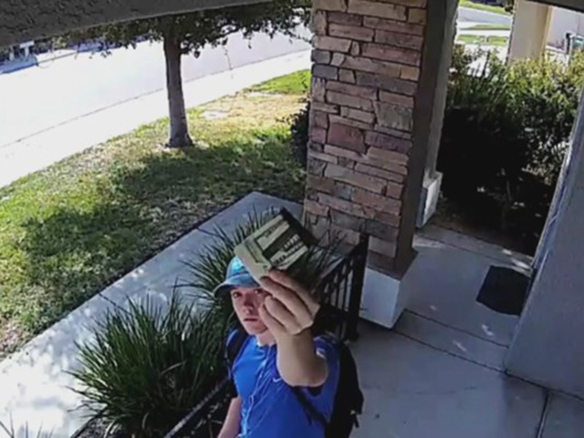

# Surveillance Camera Surprise
**Melissa Vang** is thrilled to see goodness lies in the hearts of teens. _"God bless this young man's heart,"_ she wrote on Facebook with a post of survillence camera footage. It shows **Tyler Opdyke, 18**, leaving her husband's wallet stuffed with _$1,500 cash_ to her doorstep after waiting for someone to answer the door. sunny skyz summarizes the event in [this article](https://www.sunnyskyz.com/good-news/2394/Security-Camera-Captures-Stranger-Returning-Wallet-Stuffed-With-1-500-In-Cash):
> Melissa Vang of Elk Grove, California, was home with her two young children when she heard someone knock at the front door. Fearing the worst, she ignored it. What she later saw on her surveillance cameras surprised her.

- Opdyke told [The Sacramento Bee](http://www.miamiherald.com/news/nation-world/national/article174302756.html) that his first reaction was “Awesome, cash!” As a struggling college student about to turn 19, “it’s our first reaction,” Opdyke said, but the thought of keeping the wallet never actually took hold
- Opdyke shows the wallet to the camera, as if he wanted the homeowner to know why he was there, and then him setting it on the doormat before walking away ([Source](http://www.king5.com/news/surveillance-video-captures-stranger-returning-wallet-stuffed-with-cash/476986735))
- Vang shared the video on Facebook in the hopes of tracking down Opdyke to thank him. In her post, she expressed sorrow for having mistrusted him when he knocked ([Source](http://www.nydailynews.com/news/national/surveillance-footage-captures-teen-returning-stranger-wallet-article-1.3509088))
