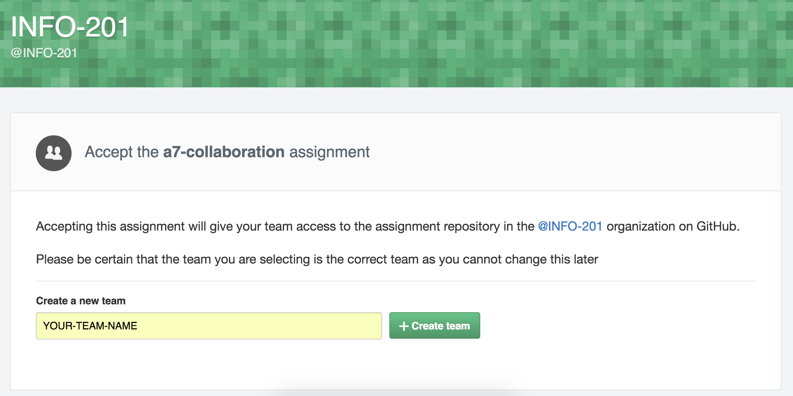
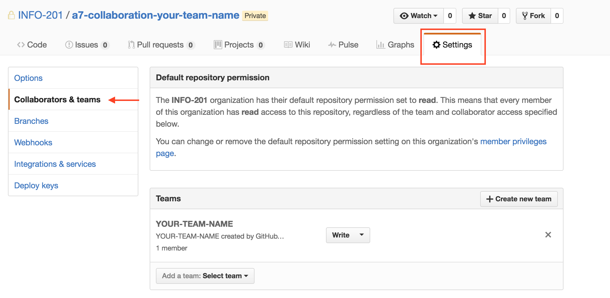
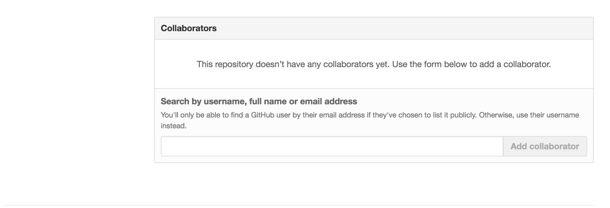

# a7-starter-repo

Starter repo for assignment 7. You should have **one repository** for
your team -- make sure to add all team members as **collaborators** to
the project.

# Overview

Almost all data-driven research projects involve multiple team members
working on the same code-base. In fact, they often involve people
working on the same documents at the same time. Luckily, git provides
a set of tools that easily facilitates project collaboration.

The purpose of this assignment is to provide you with the opportunity
to practice using these collaboration tools. Something will likely go
wrong, which is really the point. Following this assignment, you'll be
prepared to dive into your final project alongside your other team
members.

# Assignment structure

For this assignment, your team will create a simple report of UFO
sightings in the United States and Canada.  The data originates from
[data.world](https://data.world/timothyrenner/ufo-sightings).  The report must include:

* A paragraph of summary information, citing at least 3 values
  calculated from the data.
* Two charts (3 if you have 5 group members) that display information
  from the data (what you visualize is up to you).

Unlike other assignments, you have to keep your code organized in multiple
different files. This helps keep your project more modular and
clear. You'll create four different files for this project:

* An index.Rmd file that renders your report
* A file with functions that calculate summary information to be included in your report
* A file with a function that returns your first chart
* A file with another function that returns another chart

You should save your .R files in a `scripts/` directory. There's more
information below about how these files interact.

# Instructions

## Set Up The Repo

As with other assignments, one person (and only one person!) will
begin by clicking the link that creates the GitHub repo.  The whole
group must work on this single repo. When they do, you will create a
team-name for your group to work under:



Once you've created your team, you should be able to add collaborators to your team:



Then, when you scroll down on that page, you should be able to add collaborators in this form:



If you experience any difficulty with this, please contact your TA as
early as possible.  

## Create GitHub Issues

In order to keep track of who needs to do what, GitHub has created the
issues tab. Typically, GitHub Issues are used on a team to assign
tasks and track progress on different parts of the project. You can
easily create and assign issues on GitHub's issues tab. For this
assignment, you should assign each of the components below to a
different group member, and keep track of your progress by closing the
issues once you've completed a task. You should close issues from the
command line when you make your commit messages.

## Report Components

As described above, you'll be creating four different files. Because
the purpose of this assignment is to practice collaboration, each
section should be completed by a different person (if you are in a
group of 5, you'll make 3 charts). We'll be checking the commit
history to ensure that each section was pushed by a different
account. Here is additional information on each section:

### index.Rmd File

In the Markdown document you create, you should leverage the functions
written in the other files to do the following:

* Write a short summary paragraph that includes information calculated
  by your summary information function
* Render your first chart
* Render your second chart

In order to render those charts, you'll need to read in your data in
your index.Rmd file, and pass your data to those functions. If it
isn't clear how to these pieces fit together, reach out to your TA.

### Summary Information File

The first file you should save in your `scripts/` directory should
contain a function that takes in a dataset as a parameter, and returns
a list of information about it. For example:

```r
## A function that takes in a dataset and returns a list of info about it:
info_function <- function(dataset) {
   ret <- list()
   ret$length <- nrow(dataset)
   ## do some more interesting stuff here
   ## add more components to 'ret', ...
   return(ret)
}
```

We don't expect you to write a generalizable function that detects
rows/columns and asks questions of your dataset. Instead, think of
this like a simple analysis you would do on this particular dataset,
just wrapped in a function. This will allow you to pass your dataset
into this function from your index.Rmd file.

### Chart File(s)

In your other .R files you create, you should write functions that
take in a dataset as a parameter, and return a visualization of that
data. This will allow you to call your charting function from your
index.Rmd file, keeping your code much easier to read and
update. Create a separate .R file for each chart.

### Submission

As with the previous assignment, you should add and commit your
changes using git, and push your assignment to GitHub. You will submit
the URL of your repository as your assignment. Only one person will
need to submit, because this is configured as a group project.

## Expectations

At this point in the quarter, we expect you to be following the best
practices we've incorporated into the class. This means:

* Proper use of libraries such as _dplyr_ for data wrangling
* Structuring your code so that if the data changes, you can easily update your entire report
* Leveraging markdown syntax to provide structure to your report
* Clearly commenting and properly organizing your code
* Writing functions to encapsulate chunks of code that you use more than once
* Avoiding the creating of variables that are unnecessary for your analysis/report
* Creating appropriate labels for your visualizations
